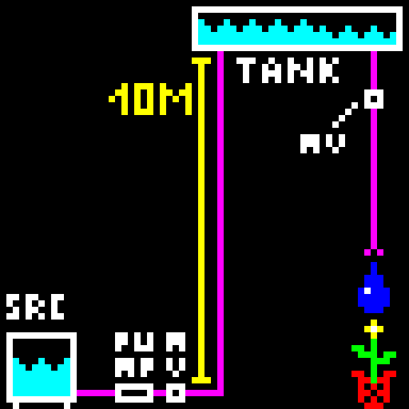

# waterthing
 Wierd Garden Watering system
 
 ## pump concept
 
The irrigation system is supposed to irrrigate via leaky hoses wich can only output little flow.

Most normal pumps can't efficiently provide this constant pressure, low flowrate flow, wich is bad becuase im planning to power this off of solar.

To fix this, the pump fills a tank about 10 meters higher, then shuts off and waits for the tank to drain out the leaky hoses after opening a magnet valve. Anadditional magnet valve is directly after the pump to prevent backflow.

This cycle is repeated until the desired amout of irrigation took place (or the water source is empty).
