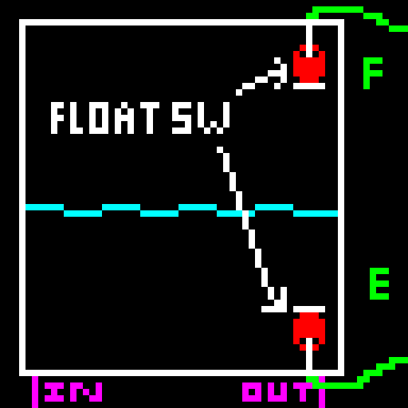

# waterthing
Wierd Garden Watering system

# very bad build guide
contact me if anything goes wrong (it will)
i will try to help if you actually want to build this
## controller
1. 3d print the case parts for the controller or come up with your own
2. put the parts in position and hotglue and screw them down
3. connect the components according to the schematic. the schematic is not the definitive way to do it though but rather a reflection of the current state of my build.
   the LoRa and LED module are optional.
4. upload the sketch and check if everything powers up and works
5. go mad because you cant find *that one error*
## gateway
1. (optional) print case and attach ESP32 LoRa Board 
2. connect antenna
3. upload sketch
4. connect to config AP and input WiFi credentials

# all shit blow this is outdated, just ignore it i will fix it some day....

## pump concept

 
The irrigation system is supposed to irrrigate via leaky hoses wich can only output little flow.

Most normal pumps can't efficiently provide this constant pressure, low flowrate flow, wich is bad becuase im planning to power this off of solar.

To fix this, the pump fills a tank about 10 meters higher, then shuts off and waits for the tank to drain out the leaky hoses after opening a magnet valve. Anadditional magnet valve is directly after the pump to prevent backflow.

This cycle is repeated until the desired amout of irrigation took place (or the water source is empty).

## tank concept

The tank has a full and empty float switch. Both pull the arduino pin low when underwater
